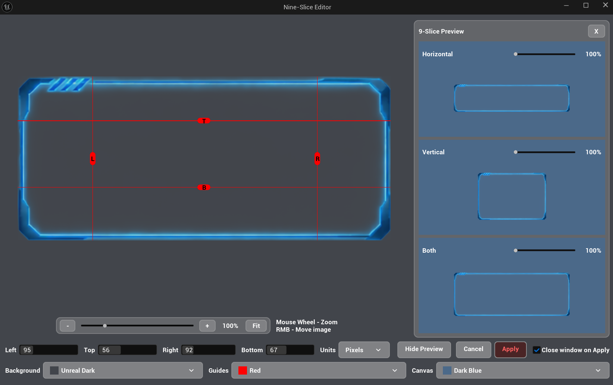
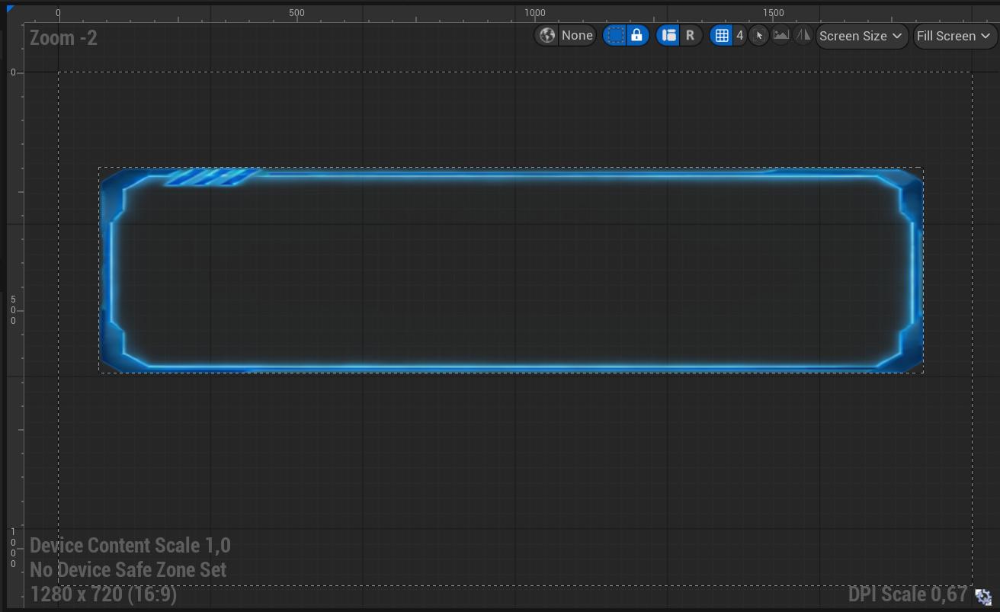
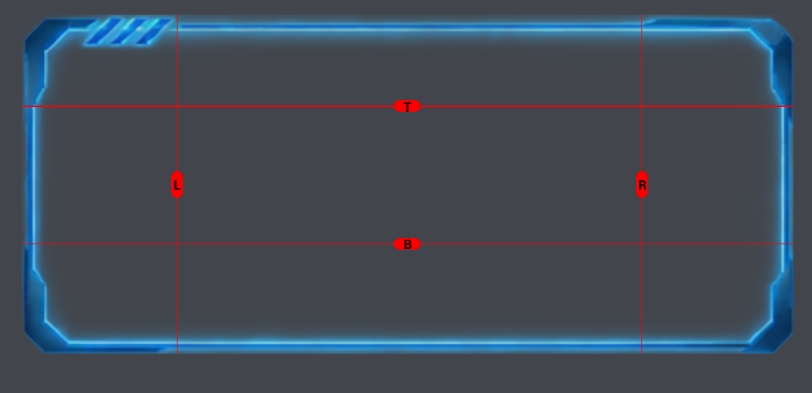
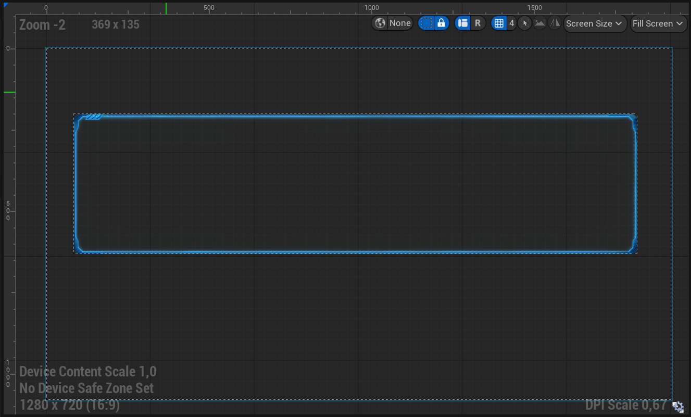
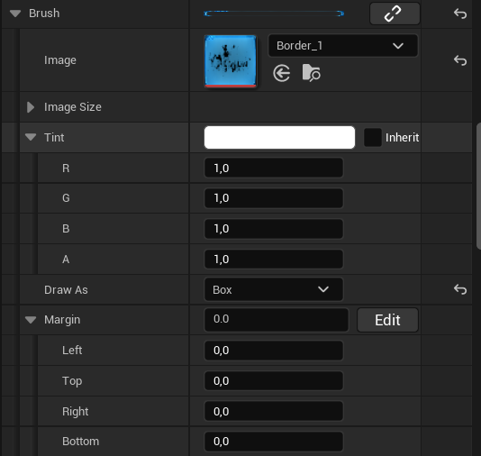

# NineSliceEditor

A small Unreal Engine editor plugin for editing and previewing Slate Brush 9-slice margins.

The plugin adds an **Edit** button next to the `Margin` property of a `Slate Brush` and opens a visual editor where the four margins can be adjusted directly on the texture.



## Contents

* [What is 9-Slice](#what-is-9-slice)
* [Using the Plugin](#using-the-plugin)
* [Installation](#installation)
* [Releases](#releases)
* [License](#license)

---

## What is 9-Slice

9-slice scaling allows a texture to be resized without stretching its corners.

A texture is divided into nine areas using four margins:

* four corners stay unchanged
* four edges stretch in one direction
* the center stretches in both directions

Without margins, the whole texture is stretched when the widget changes size:



The four margins define the parts that should stay fixed. The editor visualizes these areas so you can see exactly how the texture will be divided:



When the brush is resized, only the appropriate areas are stretched while the corners keep their original size:



This is commonly used for UI backgrounds, buttons, panels, windows, borders, and other elements that need to support different sizes.

The plugin is useful when setting Margin values by hand becomes inconvenient. Instead of guessing the correct values in the Details panel, NineSliceEditor lets you adjust the margins directly on the texture and immediately see the result.

---

## Using the Plugin

### Opening the Editor

Select a `Slate Brush` in the Details panel.

The `Margin` property only affects Slate Brushes using **Box** or **Border** draw modes.

Next to the `Margin` property, press **Edit**.



The NineSliceEditor window will open.


### Editing Margins

The editor displays four draggable guides:

* **Left**
* **Top**
* **Right**
* **Bottom**

Drag a guide with **LMB** to change its position.

The values can be displayed using different units:

* **Pixels**
* **Normalized**
* **Percentage**

### Mouse Controls

| Input              | Action                     |
| ------------------ | -------------------------- |
| LMB + drag a guide | Change the selected margin |
| RMB + drag         | Move the image             |
| Mouse Wheel        | Zoom in / out              |

### Zoom Controls

The editor also has zoom controls:

* **−** — zoom out
* **+** — zoom in
* **Fit** — fit the image to the available space

### Color Controls

The editor allows changing several visual elements:

* **Background** — editor background
* **Guide** — margin guides and handles
* **Canvas** — preview texture background

Presets are available for each category.

### Preview

The **Preview** panel shows how the current margins behave when the brush is resized.

It contains three examples:

* **Horizontal** — horizontal resizing
* **Vertical** — vertical resizing
* **Both** — horizontal and vertical resizing

The preview also includes scale controls.

### Apply and Cancel

* **Apply** — saves the current margins to the brush and closes the editor window
* **Cancel** — closes the editor without applying the changes

---

## Installation

### Using a Release

Download the plugin ZIP for your Unreal Engine version from the [Releases](../../releases) page and extract it into your project's `Plugins` folder.

For example:

```text
YourProject/
└── Plugins/
    └── Developer/
        └── NineSliceEditor/
```

Then open the project in Unreal Engine.

### Getting the Source Code

You can clone the repository:

```bash
git clone https://github.com/DontFWithTheJ/NineSliceEditor.git
```

Or download the repository using **Code → Download ZIP** on GitHub.

### Rebuilding the Plugin

If there is no release for your Unreal Engine version, you can build the plugin from source.

#### Using Unreal Automation Tool

This is the easiest way to package the plugin without creating a separate Unreal project.

On Windows, run:

```bat
<UnrealEngine>\Engine\Build\BatchFiles\RunUAT.bat BuildPlugin -plugin="C:\Path\To\NineSliceEditor.uplugin" -package="C:\Path\To\Output\NineSliceEditor"
```

The `-plugin` argument points to the plugin's `.uplugin` file.

The `-package` argument specifies the output directory for the packaged plugin.

After the build finishes, copy the packaged plugin into the `Plugins` folder of your Unreal Engine project.

Use the `RunUAT.bat` from the Unreal Engine version you want to build the plugin for.

#### Building Through an Unreal Project

The plugin can also be placed into a C++ Unreal Engine project and built using the **Development Editor** target from your IDE.

This method is useful when modifying or debugging the plugin.

The plugin may require source code changes when built with a different Unreal Engine version due to API or build system changes.

---

## Releases

| Version | Unreal Engine | Download                                    |
| ------- | ------------- | ------------------------------------------- |
| v1.0.0  | UE 5.7        | [GitHub Release](../../releases/tag/v1.0.0) |

---

## License

NineSliceEditor is free to use in personal, educational, and commercial projects.

The plugin itself may not be sold, sublicensed, or redistributed as a standalone commercial product.

See the [LICENSE](LICENSE) file for the full terms.
